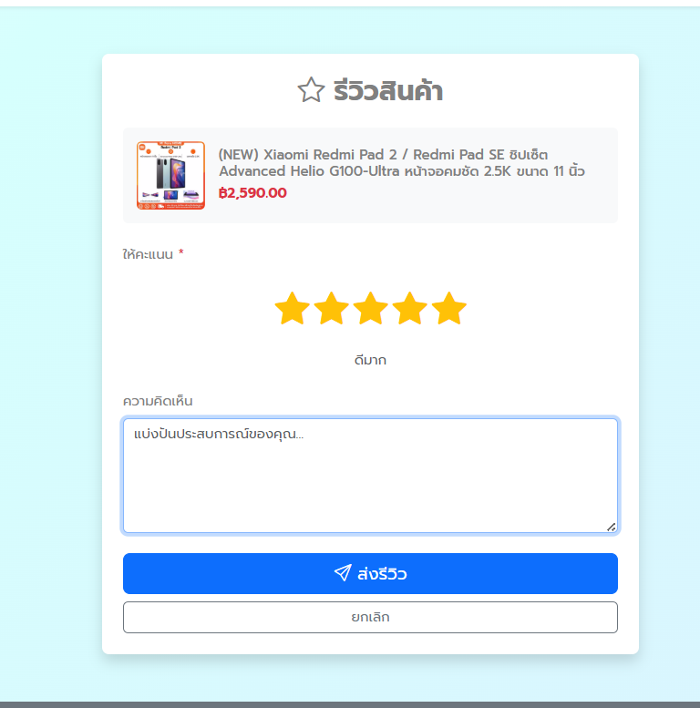

# 🛒 DailyLife Store - E-commerce Platform

ระบบ E-commerce แบบครบวงจร สำหรับผู้ขายและผู้ซื้อ พัฒนาด้วย Laravel 12 และ Bootstrap 5

.png)
.png)

## ✨ Features (ฟีเจอร์หลัก)

### 🛍️ สำหรับผู้ซื้อ (Buyer)
- ✅ ระบบสมัครสมาชิก/เข้าสู่ระบบ
- ✅ เรียกดูสินค้าพร้อมระบบกรอง (หมวดหมู่, ราคา, เรตติ้ง)
- ✅ ตะกร้าสินค้า (เลือกสินค้าหลายรายการ)
- ✅ ซื้อเลย (Buy Now - ข้ามตะกร้า)
- ✅ ชำระเงิน (COD, โอนเงิน, พร้อมเพย์)
- ✅ ติดตามพัสดุแบบ Real-time
- ✅ ระบบรีวิวสินค้า (เฉพาะที่ซื้อแล้ว)
- ✅ ประวัติการสั่งซื้อ + ใบเสร็จ

### 🏪 สำหรับผู้ขาย (Seller)
- ✅ สร้างร้านค้า (ชื่อร้าน, ที่อยู่, โลโก้)
- ✅ จัดการสินค้า (เพิ่ม/แก้ไข/ลบ)
- ✅ Dashboard สถิติยอดขาย
- ✅ จัดการคำสั่งซื้อ
- ✅ อัปเดทหมายเลขพัสดุ
- ✅ ระบบขนส่ง - ยืนยันส่งสำเร็จ

### 📦 ระบบอื่นๆ
- ✅ ระบบสต็อกสินค้า (ลดอัตโนมัติเมื่อมีการสั่งซื้อ)
- ✅ ระบบเรตติ้งและรีวิว
- ✅ สถิติยอดขาย
- ✅ Multi-Shop Support (หลายร้านค้า)

---

## 🛠️ เทคโนโลยีที่ใช้

- **Backend:** Laravel 12.x (PHP 8.2+)
- **Frontend:** Bootstrap 5, Blade Template
- **Database:** MySQL
- **Authentication:** Laravel Breeze
- **File Storage:** Laravel Storage (Public Disk)
- **Icons:** Bootstrap Icons

---

## 📋 ความต้องการของระบบ

- PHP >= 8.2
- Composer
- MySQL >= 5.7
- Node.js & NPM

---

## 🚀 การติดตั้ง (Installation)

### 1. Clone Repository
```bash
git clone https://github.com/nabeelsm01/dailylife-store.git
cd dailylife-store
```

### 2. ติดตั้ง Dependencies
```bash
composer install
npm install
npm run build
```

### 3. ตั้งค่า Environment
```bash
cp .env.example .env
php artisan key:generate
```

แก้ไข `.env`:
```env
DB_DATABASE=your_database
DB_USERNAME=your_username
DB_PASSWORD=your_password
```

### 4. สร้าง Database และ Migrate
```bash
php artisan migrate --seed
```

### 5. สร้าง Storage Link
```bash
php artisan storage:link
```

### 6. รันเซิร์ฟเวอร์
```bash
php artisan serve
```

เปิดเบราว์เซอร์:http://127.0.0.1:8000/

---

## 👥 User Roles (บทบาทผู้ใช้)

| Role | Email | Password | สิทธิ์ |
|------|-------|----------|--------|
| Admin | admin@example.com | password | จัดการทั้งระบบ |
| Seller | seller@example.com | password | จัดการร้านค้า |
| Buyer | buyer@example.com | password | ซื้อสินค้า |

---

## 📸 Screenshots (ภาพตัวอย่าง)

### หน้าแรก
.png)
.png)

### สินค้าทั้งหมด + ระบบกรอง
.png)
.png)

### รายละเอียดสินค้า + รีวิว
.png)
.png)

### รายละเอียดการสั่งซื้อ * ติดตามการสั่งซื้อ + ประวัติการสั่งซื้อ
.png)
.png)

.png)
.png)

.png)
.png)

### รีวิว rating+comments


### Dashboard ผู้ขาย
.png)
.png)

(1).png)
(2).png)

(2).png)
(2).png)

---

## 📊 Database Schema (โครงสร้างฐานข้อมูล)
```
users (ผู้ใช้)
├── shops (ร้านค้า)
│   └── products (สินค้า)
│       ├── reviews (รีวิว)
│       └── order_items (รายการสั่งซื้อ)
│
└── orders (คำสั่งซื้อ)
    ├── order_items
    ├── payments (การชำระเงิน)
    └── shippings (การจัดส่ง)
sellers(status) (ผู้ขาย)
|__ myshops (ร้านของฉัน)
    |__ manage_product(จัดการสินค้า เพิ่ม/ลบ/แก้ไข)
    |__ manage_order(ตรวจสอบการสั่งซื้อ)
     

## 🎯 API Endpoints (ถ้ามี)
```
GET  /api/products          - รายการสินค้าทั้งหมด
GET  /api/products/{id}     - รายละเอียดสินค้า
POST /api/cart/add          - เพิ่มสินค้าลงตะกร้า
...
```

---

## 🐛 Known Issues / TODO

- [ ] เพิ่มระบบแจ้งเตือน (Notifications)
- [ ] ระบบแชทระหว่างผู้ขาย-ผู้ซื้อ
- [ ] รองรับหลายภาษา (i18n)
- [ ] Export รายงานเป็น PDF/Excel
- [ ] Payment Gateway (Stripe, PayPal)

---

## 🤝 Contributing

Pull requests are welcome! For major changes, please open an issue first.

---

## 📝 License

[MIT License](LICENSE)

---

## 👨‍💻 Author

**Your Name**
- GitHub: [@Nabeelsm01](https://github.com/Nabeelsm01)
- LinkedIn: [Nabil Hayeesamoh](www.linkedin.com/in/nabil-hayeesamoh-66016532b)
- Email: nabilsm.2545@gmail.com

---

## 🙏 Acknowledgments

- Laravel Framework
- Bootstrap
- Bootstrap Icons
